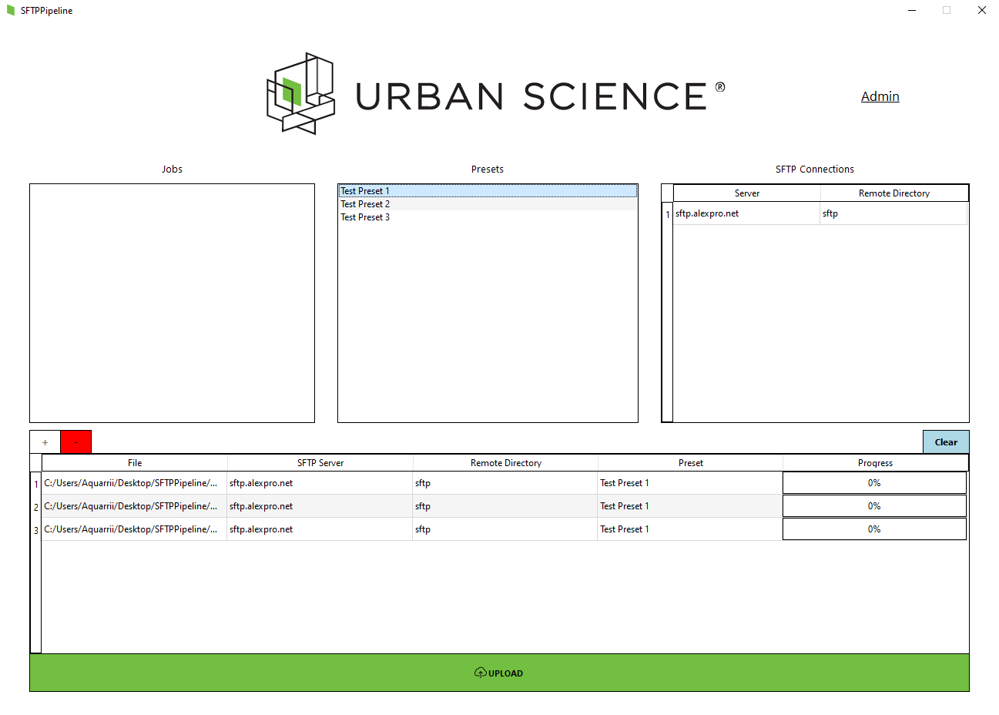

# Jordan Phillips
*Software Engineer*

# [View Resume >](Jordan Phillips Resume.pdf)

# Education
* Bachelors of Science (Computer Science), *Tennessee Technological University*, 2019-2023
* Minor in Mathematics

* Currently Pursuing Masters of Science (Data Science), *University of Colorado Boulder*, 2023-Present

# [Internship App 1: CPS Car Seat Safety](https://play.unity.com/mg/other/jordan-phillips-cps-car-seat-safety)

This project is included in the National Highway Traffic Safety Administration's nationwide curriculum, and is used to educate parents on car seat safety.
* **Company:** Tennessee Tech iCube
* **Technologies used:** C#, Unity, FBX Modeling
* **Details:** Allows the user to view a 3D car seat model, and select each individual part of the model.

# [Internship App 2: Impairment Arcade Mobile App](https://play.google.com/store/apps/details?id=com.iCube.ImpairmentArcade)

This project is currently available on the iOS App Store and Google Play, and is meant to teach children on the dangers of impairment.
* **Company:** Tennessee Tech iCube
* **Technologies Used:** C#, Unity
* **Details:** Hosts four different arcade-style games, each showcasing a unique visual impairment to simulate a physical impairment.

# [Senior Project: SFTP Pipeline](https://github.com/Jorphi/SFTP-Pipeline)

This was my senior project at TTU. Using an Agile workflow, I worked a team of 5 peers to overhaul Urban Science's current file upload system.
* **Companies:** Tennessee Tech University, Urban Science
* **Technologies Used:** Python, SQL Server, Agile Methodologies
* **Details:** Developed a Python GUI and SQL Server backend from scratch in order to enhance the workflow and file reporting for Urban Science's employees. This is currently in production at their offices in Franklin, TN.

# Contact
* [**Linkedin**](https://www.linkedin.com/in/jorphi)
* **Email:** jorphi2@gmail.com
* **Phone:** +1 (931) 267-0426

